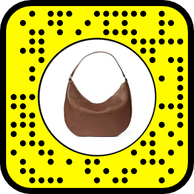

# 👜 Virtual Bag Try-On AR

Virtual Bag Try-On AR is an Augmented Reality experience developed using Snap Lens Studio and JavaScript.

The Lens allows users to virtually try on two different bags in AR. The bags are positioned using body and shoulder tracking, and users can tap the screen to switch between the available bags.

## 🎮 Try the Lens

[Open Virtual Bag Try-On on Snapchat](https://www.snapchat.com/unlock/?type=SNAPCODE&uuid=1921ed44a95d48b5b2bc657fc773aef2&metadata=01)

Scan the Snapcode below using Snapchat to try the Lens.



## 👜 About the Experience

This project demonstrates a virtual product try-on experience using Augmented Reality.

The Lens uses body tracking and shoulder tracking to position the virtual bag on the user's body. Two different bags are available, and the user can tap the screen to switch between them.

## ✨ Features

- 👜 Virtual bag try-on experience
- 👤 Body tracking
- 🎯 Shoulder tracking
- 🔄 Two different virtual bags
- 👆 Tap to switch between bags
- 📱 Snapchat AR Lens experience
- 💻 JavaScript-based interaction
- 🎨 Custom 3D bag assets
- 🌐 Real-time AR placement

## 🕹️ How to Use

1. Open the Virtual Bag Try-On Lens on Snapchat.
2. Allow camera access if required.
3. Position yourself in front of the camera.
4. The Lens detects the user's body and shoulders.
5. The virtual bag is positioned on the shoulder area.
6. Tap the screen to switch between the two available bags.
7. Try different bags directly through the AR experience.

## 🛠️ Technologies Used

| Technology | Purpose |
|---|---|
| Snap Lens Studio | AR development and Lens creation |
| JavaScript | Bag switching and interaction logic |
| Body Tracking | Detecting the user's body |
| Shoulder Tracking | Positioning the virtual bag |
| 3D Models | Virtual bag assets |
| Touch Interaction | Switching between bags |

## 🧠 JavaScript Implementation

The project uses JavaScript to control the bag switching interaction.

| Script | Responsibility |
|---|---|
| `BagSwitcher.js.js` | Handles switching between the two virtual bags |

## 🎯 AR Tracking

The experience uses body and shoulder tracking to create a more natural virtual try-on.

```text
User
  ↓
Body Tracking
  ↓
Shoulder Tracking
  ↓
Detect Shoulder Position
  ↓
Position Virtual Bag
  ↓
AR Try-On Experience
